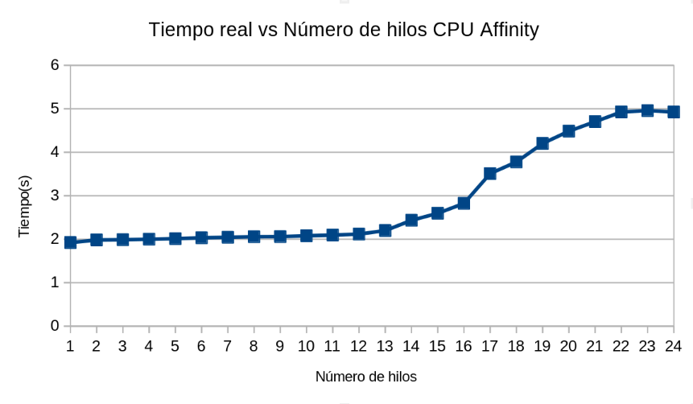
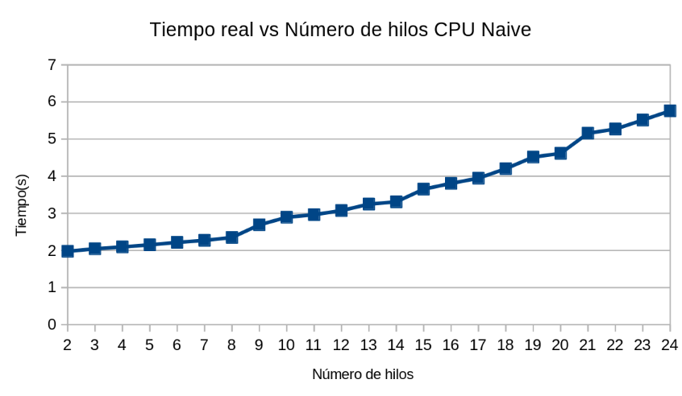
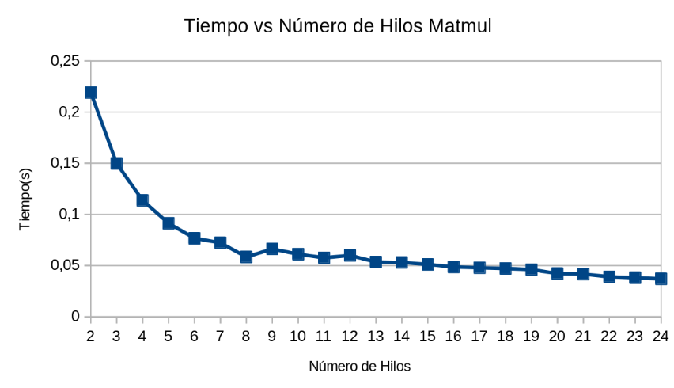
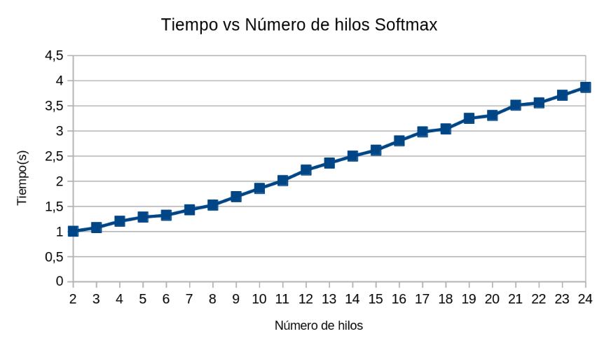

# Práctica Clase Semana 4 - Sistemas multiprocesador y su programación

## Especificaciones del equipo utilizado

| Componente | Detalle |
|---|---|
| Sistema operativo | Fedora Linux |
| CPU | 13th Gen Intel(R) Core(TM) i7-13700K |
| Arquitectura | Híbrida: 8 P-cores con Hyper-Threading (16 hilos lógicos) + 8 E-cores (sin HT) |
| CPUs lógicos totales | 24 |
| Frecuencia máxima P-cores | 5.3 GHz |
| Frecuencia máxima E-cores | 4.2 GHz |
| Memoria RAM | 31 GiB |

## Resultados obtenidos Práctica clase 3 Ejercicio A

## Discusión de resultados Práctica clase 3 Ejercicio A

Comparando los resultados, podemos observar que el resultado de CPU Affinity es 1.17 veces más rápido que CPU-naive con 24 hilos (5.760s vs 4.926s).
Ambos códigos cuentan con la parte cpu_burn que es el cálculo pesado que cada hilo hace en paralelo, pero lo que hace CPU Naive sea más lento es su parte serial, especificamente el malloc y el llenado de los 256MB por hilo, por medio de la Ley de Amdahl, esta parte serial esta limitando la optimización del programa.
Si se toma en cuenta la gráfica de la Ley de Amdahl, es posible denotar que con unos 24 hilos, y un speedup de 1.17x, podemos denotar que la parte paralela del código es menor al 50%.
Pero la razón del porque a pesar de que CPU Affinity paralelizo su inicialización comparado con CPU-naive, y solo tenga un 17% de mejora, es debido que esa optimización es tan pequeña comparado al cálculo principal que la influencia es mínima y casi no provoca un cambio.

Observando las gráficas, ambas crecen linealmente de forma muy similar hasta llegar al hilo 17, con la observación de que CPU naive cada vez se atrasa un poco más por esa diferencia ya mencionada.
CPU Affinity termina pegando un brinco en el tiempo pasado el hilo 17 debido a que entra en el primer E-core, lo que significa que la frecuencia es menor a los anteriores hilos.

En CPU Naive también llega a suceder dicho brinco, pero es más leve y sucede entre el hilo 20 y 21, esto debido a la falta de la afinidad del código, entonces hasta ese punto es que el CPU decide usar los E-core.

Si se calcula la eficiencia de cada uno de los códigos, con la fórmula de η = S/n, donde tomando la eficiencia de 24 hilos, con el speedup individual de cada código, se lleva a obtener que CPU Affinity tiene una eficiencia de 1.6% y CPU Naive de 1.4%. A pesar de que los valores sean bajos, esto no es debido a que el paralelismo falló, sino que fue debido a que el trabajo realizado aumenta con cada hilo, debido a los 256MB que procesa cada hilo, pero a pesar de eso si existe una diferencia entre ambas eficiencias donde con CPU Affinity es posible observar esa pequeña diferencia gracias a esa inicialización paralela que tiene.

## Resultados obtenidos Práctica clase 3 Ejercicio B

## Discusión de resultados Práctica clase 3 Ejercicio B

Analizando los resultados obtenidos de matmul, es posible observar que con respecto al primer hilo y al último, se llega a tener un speedup de 11.35 (0.420651s vs 0.037050s). Obtenido este dato podemos usar la formula para obtener el % paralelo del código, S = 1/(s + (1-s)/n), con n = 24 y S = 11.35, nos da que la parte serial del código es de 4.8% y tomando en cuenta que p = 1-s, nos da que la parte paralela da 95.2%
Si se compara con la ley de Amdahl es posible observar que nos encontramos un poquito por encima de la curva del 95%, pero lejano a encontrarnos en el techo, es decir en el speedup esperado, esto es debido a que a pesar de tener un 95% de código paralelo, esta parte paralela no se reparte equitativamente entre todos los hilos, lo que termina costando un porcentaje de eficiencia a mayor cantidad de hilos, algunos hilos llegan a terminar su trabajo antes de tiempo que otros.

Por otro lado Softmax, solo sube el tiempo a medida que aumenta la cantidad de hilos, cada hilo agrega un overhead fijo, evitando que se disminuya el tiempo total, la ley de Amdahl no se puede aplicar aca debido a que realizando el speedup siempre da negativo, y la ley de Amdahl no prevee que aumentar procesadores aumentaría el tiempo.
Esto se debe a que la parte serial del código excede con creces a la parte paralela, aplicando un comportamiento inverso
Al final de cuentas, el código termina costando en la sincronización del los hilos más que en el cómputo.

## Resultados obtenidos Práctica clase 4 Ejercicio A y B

| Versión | Fill A (µs/iter) | Fill B (µs/iter) | Add (µs/iter) |
|---|---|---|---|
| Estática  | 232.48 | 231.90 | 408.10 |
| Dinámica  | 535.78 | 524.38 | 656.92 |
| **Razón (dinámica/estática)** | **2.30x** | **2.26x** | **1.61x** |

## Discusión de resultados Práctica clase 4 Ejercicio A y B

Es posible observar que con la librería dinamica, la duración es mayor debido a los saltos binarios que se estan realizando para realizar una llamada externa.
La biblioteca dinámica no se incorpora directamente al ejecutable durante el enlazado, las dependencias se terminan solucionando en tiempo de ejecución, mientras que por otro lado la biblioteca estática si queda incorporada dentro del ejecutable en el proceso de enlazado.
Al ser tantos llamados debido al millón de elementos, termina provocando que el costo de cada salto se vaya acumulando hasta ser significativo, provocando esa diferencia de tiempos.

**Autor:** Gerson Adrián Cordero Zúñiga 

**Curso:** Introducción a la Computación Heterogénea

**Profesor:** Luis Gerardo León Vega